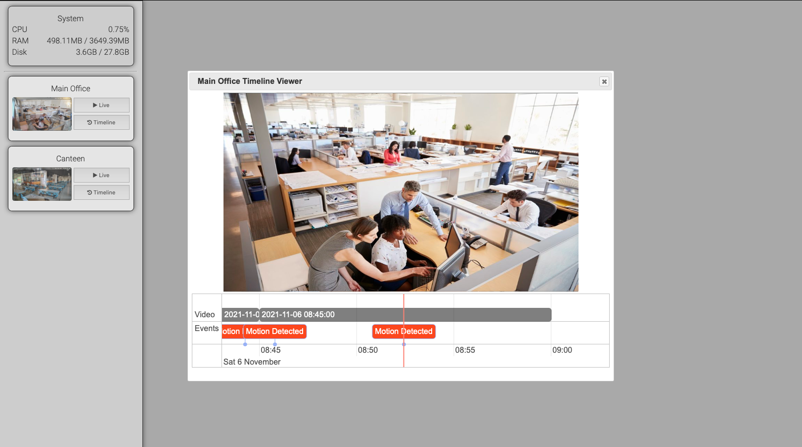

  

# nvr-js


[](https://lgtm.com/projects/g/marcus-j-davies/nvr-js/context:javascript)


NVR JS is a simple, very lightweight and efficient CCTV NVR based on Node JS.  
it's primarily aimed for 24/7 recording and live viewing.

Under the hood it uses ffmpeg, node js, websockets and sqlite, all wrapped in a web based user interface.
The NVR has an API that allows to create events and timestamp them on the 24/7 recordings.

The 24/7 recordings can be reviewed using a timeline UI where the events are also time aligned on that same timeline.

 

### Inspired by shinobi.video
[Shinobi](https://shinobi.video) is a fully featured, jam packed NVR, also built using Node JS.
I was using Shinobi and thought it was amazing! - however, it had sooo much to it, and was too overkill for my needs.

You can think of NVR-JS as a very slimed down version of shinobi video, built from the ground up.  
the table below, shows how slimmed down it is.

| Feature           | Shinobi | NVR JS              |
|-------------------|---------|---------------------|
| Motion Dectection | &check; |                     |
| Object Detection  | &check; |                     |
| 24/7 Recording    | &check; | &check;             |
| Event Creation    | &check; | &check; (API Only)  |
| Notifications     | &check; |                     |
| Live Streaming    | &check; | &check; (Websocket) |
| Configuration UI  | &check; | Manual Editing      |
| Mobile Support    | &check; |                     |

As you can see, NVR JS does not pack the same features as Shinobi Video, but that's the intention.  
NVR JS is designed for 24/7 recording with access to live footage, and the 24/7 recordings.

### Configuration.
The first time you start NVR JS, it will create a config file at **/%home%/nvrjs.config.js**,  
it will then terminate allowing you to start adjusting your system, before starting it up again.

```javascript
module.exports = {
	/* System Settings */
	system: {
		/* Username */
		username: "admin",
		/* bcrypt password (default: admin) */
		password: '$2a$10$CnOx/6vFY2ehRDf68yqd..aLlv0UM.zeBLKnRjuU8YykCsC2Ap3iG',
		/* bcrypt API Key (default: x7Te9m38JHQq6ddv) */
		apiKey: '$2a$10$N53ci.EIQ7JCu6u1HlOjoO//W0Bmp3GrRruyK1Jysr01CQ1rDrVQK',
		/* Any random string */
		cookieKey: 'f3gi6FLhIPVV31d1TBQUPEAngrI3wAoP',
		interfacePort: 7878,
		/* location used for 24/7 recording and database generation */
		/* This should be the root of a mount point i.e a dedicated HDD for 24/7 recordings */
		storageVolume: '/Volumes/CCTV',
		/* Continuous recording settings */
		ffmpegLocation: 'ffmpeg',
		continuousSegTimeMinutes: 15,
		continuousDays: 14,
		continuousPurgeIntervalHours: 24,
		/* event throttle per sensorId */
		eventSensorIdCoolOffSeconds: 60
	},
	/* Cameras */
	cameras: {
		'66e39d21-72c4-405c-a838-05a8e8fe0742': {
			name: 'Garage',
			/* Input Source Config */
			/* The keys and values represent the ffmpeg options */
			inputConfig: {
				use_wallclock_as_timestamps: '1',
				fflags: '+igndts',
				analyzeduration: '1000000',
				probesize: '1000000',
				rtsp_transport: 'tcp',
				stimeout: '30000000'
			},
			/* Input Address */
			input: 'rtsp://user:password@ip:port/live0',
			/* Recording 24/7 */
			/* Disabling continuous recording, will disable the ability to create events */
			continuous: true,
			/* Live streaming config */
			/* These settings should be good enough for a low delay live stream, providing your camera produces h264 frames */
			/* streaming is achieved with websockets and MP4 fragments */
			liveConfig: {
				codecString: 'video/mp4; codecs="avc1.64001f"',
				streamConfig: {
					an: '',
					vcodec: 'copy',
					f: 'mp4',
					movflags: '+frag_keyframe+empty_moov+default_base_moof',
					reset_timestamps: '1'
				}
			}
		}
	}
};
```


### The Event API.
To create events one only needs to send the following JSON payload.

The view here, is that you create events from various sensors in your setup, this effectively acts as your motion detector
or some other key event - It's really up to you. 

```javascript
{
     "name": "Motion Detected" | "Door Opened" | "Some Other Event" | "Of Your Choice",
     "sensorId": "HUEN849",
     "date": 1636194611
}
```

You **POST** this payload to the API as follows:  
http://IP:7878/api/{APIKey}/event/{camera-id}  
Example: http://IP:7878/api/x7Te9m38JHQq6ddv/event/66e39d21-72c4-405c-a838-05a8e8fe0742

### Anyway
I built this for my needs, it's very DIY and will likely have some faults in some places.  
But if you want to use it, change it, build on it, feel free - I welcome PR's.

```
npm install nvr-js
cd ./node_modules/nvr-js
pm2 start NVRJS.js
pm2 save
```

[Change Log](./CHANGELOG.md)
